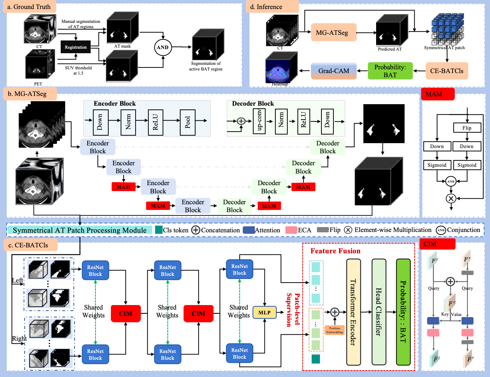

# BATNet: Symmetry-Aware Deep Learning for Brown Adipose Tissue Detection



## Table of Contents
1. [Key Features](#key-features)
2. [Installation](#installation)
3. [Quick Start](#quick-start)
4. [Data Preparation](#data-preparation) 
5. [Model Architecture](#model-architecture)
6. [Training](#training)
7. [Sample Data](#Sample-Data)

## Key Features

### Segmentation Stage (MG-ATSeg)
- **Mirror Attention Module** enforces anatomical symmetry
- **Multi-slice input** (5 consecutive slices)
- **Dice + BCE loss** for robust training

### Classification Stage (CE-BATCls) 
- **Contralateral Interaction Module** compares left-right patches
- **Hybrid ResNet-Transformer** architecture
- **Three-class patch labeling**:
  - Positive (>10% BAT voxels)
  - Negative (0% BAT)
  - Ignored (0-10% BAT)
  
## Installation

### Prerequisites
- Ubuntu 16.04.4 LTS
- Python 3.6.13
- Pytorch 1.10.0+cu113
- NVIDIA GPU + CUDA_10.1 CuDNN_8.2
This repository has been tested on NVIDIA TITANXP. Configurations (e.g batch size, image patch size) may need to be changed on different platforms.

### Setup
```bash
# Clone repository
git clone --recurse-submodules https://github.com/zhjtwx/BATNet.git
cd BATNet
# Install core packages
pip install -r requirements.txt
```

## Quick Start

### Inference Example

#### Fat segmentation model inference example for the whole case
```python
import sys
sys.path.append('./MG_ATSeg')
from patient_fat_inf import InfATMask
# Initialize 
at_seg_model = InfATMask(model_file="mg_stseg.pth", # MG_ATSEG training saved model
                            device_ids=[1,2] 
                            )
# Run seg
# The input is the entire DICOM saved nii format data，The output is the fat segmentation mask corresponding to the entire nii
at_seg_mask = seg_at_model.inf_case_at(ct_nii_path='./data/cls_data/train/case_001/image.nii.gz') 
```

#### Classification of BAT
```python
import sys
sys.path.append('./CE_BATCIs')
from ce_infer import InfATMask
# Initialize 
predictor = BATInference(
        model_path='ce_batcis.pth', # CE_BATCIs training saved model
        device='cuda'  # or 'cpu'
    )
# Run classification
predictor.batch_predict(
        data_dir='./data/cls_data/train/case_*',
        output_csv='prediction_results.csv'
    )

# Batch input is possible. The input format is described in "data-preparation". A csv file is output, which records "patient ID", "case-level predicted brown fat probability", "case-level predicted brown fat label", and "patch-level maximum predicted probability". The table format is as follows
```

#### prediction_results.csv
| case_id | pred_prob | pred_label | max_patch_prob |
|-----------|--------------|-------------|-------------|
| case0 |   0.12653 | 0 | 0.2178 |
| ... | ... | ... | ... |

## Data Preparation
### Directory Structure
```python
data/
├──seg_data/  # Data for MG_ATSeg    
│    ├── train/
│    │   ├── case_001/
│    │   │   ├── data_png/
│    │   │   │      ├── 0.png
│    │   │   │      ├── 1.png
│    │   │   │      └── ...
│    │   │   └── data_mask/
│    │   │          ├── 0.png
│    │   │          ├── 1.png
│    │   │          └── ...
│    │   └── case_002/
│    └── test/
└──cls_data/ # Data for CE_BATCIs
     ├── train/
     │   ├── case_001/
     │   │   ├── image.nii.gz  # The entire CT is saved in nii format. This path must exist. Input for MG_ATSeg model inference.
     │   │   ├── fat_mask.nii.gz  # Fat mask. If this path is missing, the MG_ATSeg fat segmentation model will be automatically called for fat segmentation.
     │   │   ├── brown_fat_mask.nii.gz # Brown fat mask, manually marked with software, if empty, the default brown fat mask mark value is all 0
     │   │   ├── ct_at_left_label.nii.gz # Labels for left patches, You can call "pro_at_patch.py" to generate it offline, or you can generate it directly in the training model.
     │   │   ├── ct_at_right_label.nii.gz # Labels for right patches, You can call "pro_at_patch.py" to generate it offline, or you can generate it directly in the training model.
     │   │   ├── ct_at_left_patch.nii.gz # left patches, You can call "pro_at_patch.py" to generate it offline, or you can generate it directly in the training model.
     │   │   └── ct_at_right_patch.nii.gz # right patches, You can call "pro_at_patch.py" to generate it offline, or you can generate it directly in the training model.
     │   └── case_002/
     └── test/
```
### Preprocessing Script
```python
import sys
sys.path.append('.')
from pro_at_patch import SymmetricalATProcessor
# Initialize 
processor = SymmetricalATProcessor(
    model_file="mg_stseg.pth"  #seg_model_file,Can be None, but when None, there must be a fat_mask.nii.gz file
)
# Run 
ct_at_left, ct_at_right, left_label, right_label = processor.process(image_file, fat_file, bat_file)
```
## model-architecture
### MG-ATSeg Components

| Module | Description | Location |
|-----------|--------------|-------------|
| MAM |   Mirror Attention Module | MG_BATCIs/model/unet_mam.py |

### CE-BATCls Components

| Module | Description | Location |
|-----------|--------------|-------------|
| CIM |   Contralateral Interaction | CE-BATCls/model/resnet_cim.py |
| Patch Processing Module |   Symmetrical AT Patch Processing Module | pro_at_patch.py |
| Transformer |   Case-Level Prediction | CE-BATCls/model/resnet_cim.py |

## Training
### MG-ATSeg Training
```bash
cd BATNet
python MG_ATSeg/train.py # Please modify the corresponding hyperparameters in train.py
```
### CE-BATCls Training
```bash
cd BATNet
python CE-BATCls/ce_train.py # Please modify the corresponding hyperparameters in ce_train.py
```

## Sample Data
We uploaded 8 chest CT images from the dataset for demonstration (3 for fat segmentation and 5 for brown fat classification). Please download the data at the following link (https://zenodo.org/records/15524145/files/data.zip?download=1). After downloading the data, please unzip the data under BATNet. Its distribution can be viewed in the directory structure section. Please note that the sample data is provided only to allow users to verify the workflow of the provided code. Since model weights are a key component of the BATNet model, which needs to be applied to business in the future, we cannot disclose the specific values ​​of model weights at present. Users can train the model with their own datasets to obtain their own model weights.
