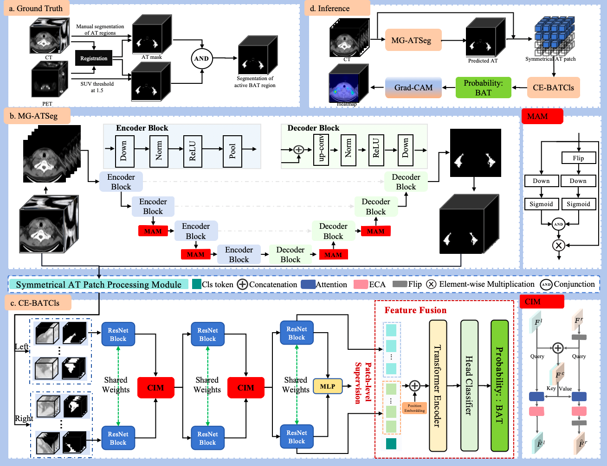

# BATNet: Symmetry-Aware Deep Learning for Brown Adipose Tissue Detection

 For details of the model structure, please refer to the paper

## Table of Contents
1. [Key Features](#key-features)
2. [Installation](#installation)
3. [Inference](#Inference)
4. [Data Preparation](#data-preparation) 
5. [Model Architecture](#model-architecture)
6. [Training](#training)
7. [Sample Data](#Sample-Data)
8. [Inference validation](#Inference-validation)
9. [Docker Environment for Quick Validation](#Docker-Environment-for-Quic-Validation)

## Key Features

### Segmentation Stage (MG-ATSeg)
- **Mirror Attention Module** enforces anatomical symmetry
- **Multi-slice input** (5 consecutive slices)
- **Dice + BCE loss** for robust training

### Classification Stage (CE-BATCls) 
- **Contralateral Interaction Module** compares left-right patches
- **Hybrid ResNet-Transformer** architecture
- **Three-class patch labeling**:
  - Positive (>10% BAT voxels)
  - Negative (0% BAT)
  - Ignored (0-10% BAT)
  
## Installation

### Environment
To improve compatibility, security, and long-term maintainability, we have upgraded the BAT-Net runtime environment. The original release was developed under an earlier software stack, while the updated release adopts a modern and actively maintained environment. Both versions have been fully validated and are fully functional. Users may choose either environment according to their hardware and software requirements.
#### Environment Comparison
| Component | Original Environment | Updated Environment |
|-----------|--------------|--------------|
| Operating System| Ubuntu 16.04.4 LTS| Ubuntu 22.04.2 LTS|
| Python | Python 3.6.13| Python 3.11|
| PyTorch | Pytorch 1.10.0+cu113| PyTorch 2.4.1 + CUDA 12.1|
| Status| Fully Supported| Fully Supported|
| Test AUC (744 cases) | 0.896| 0.896|

#### Reproducibility Verification

Both the original and updated environments have been extensively validated. On the independent test cohort of 744 cases, both versions achieved an identical AUC of 0.891. In addition, we tested the model on multiple GPU platforms, including the NVIDIA GeForce RTX 3090 and the NVIDIA Tesla V100-SXM2-32GB. While minor numerical differences may occur in the predicted probabilities across different GPU architectures (typically at the fifth decimal place), the overall evaluation metrics—including AUC, sensitivity, and specificity—remain unchanged. 

### installation steps
#### Updated Environment
```bash
# Clone repository
git clone --recurse-submodules https://github.com/zhjtwx/BATNet.git
cd BATNet
# Install core packages
1.Create Conda Environment
conda create -n batnet python=3.11 -y
conda activate batnet

2.Install PyTorch with CUDA 12.4
pip install torch==2.4.1 torchvision==0.19.1 torchaudio==2.4.1

3.Install Other
pip install -r requirements.txt
```
#### Original Environment
```bash
# Clone repository
git clone --recurse-submodules https://github.com/zhjtwx/BATNet.git
cd BATNet
# Install core packages
1.Create Conda Environment
conda create -n batnet python=3.6.13 -y
conda activate batnet

2.Install PyTorch with CUDA 11.3
pip install torch==1.10.0+cu113 torchvision==0.11.0+cu113 -f https://download.pytorch.org/whl/torch_stable.html

3.Install Other
pip install -r requirements_old.txt
```
#### Expected Install Time
The installation typically takes:
- **15-25 minutes** on a normal desktop with good internet connection
- May extend to **30-45 minutes** if compilation is required for your specific system

### Docker Environment
To facilitate rapid validation and reproducibility, we provide a fully pre-configured Docker environment. The Docker package includes:
- **Complete runtime dependencies**
- **BAT-Net source code**
- **Example datasets**
- **model weights**

#### Download Link
The Docker image can be downloaded from:[https://zenodo.org/records/19756491/files/batnet-image-v2.tar.gz?download=1] 
#### Quick Start
After downloading the archive, navigate to the directory containing the file and execute the following commands to load the Docker image and launch the BAT-Net runtime environment:
```bash
docker load -i batnet-image-v3.tar.gz # Load the Docker image after downloading
docker run --gpus all -it --rm --runtime=nvidia --shm-size=16g batnet-image:v3 /bin/bash
```
#### Note! We recommend using Ubuntu 22.04 or later for optimal compatibility and performance.

## Inference
BAT-Net is a cascaded deep learning framework consisting of two sequential modules: an adipose tissue segmentation model and a brown adipose tissue (BAT) classification model. In this updated release, we have added a new unified inference script, bat_inf.py, which provides a streamlined and flexible interface for model deployment. The script supports multiple input formats and automatically selects the appropriate inference pipeline based on the provided data, making BAT-Net significantly easier to use for both end-to-end prediction and rapid evaluation of preprocessed cases.

### Validation Datasets
We provide two complementary validation datasets:
#### Adipose Patch Dataset (n = 744)
This dataset contains preprocessed bilateral adipose patches extracted from the independent holdout cohort. It is designed for validating the BAT classification module only.
#### Complete CT Dataset (n = 10)
This dataset contains complete chest CT scans in NIfTI format together with their corresponding lung masks. It enables end-to-end validation of the full BAT-Net pipeline, including adipose tissue segmentation, patch extraction, and BAT classification.
#### Download
The validation dataset can be downloaded from Zenodo: https://zenodo.org/records/17541503/files/data.zip?download=1;
##### Password: batnet
After downloading and extracting the archive, place the data directory in the BAT-Net project root.
#### Directory Structure of Validation Datasets
```ba sh
data/
├── crop_744/
│   ├── info.csv
│   ├── case_0001/
│   │   ├── ct_at_left_patch.nii.gz
│   │   └── ct_at_right_patch.nii.gz
│   ├── case_0002/
│   │   ├── ct_at_left_patch.nii.gz
│   │   └── ct_at_right_patch.nii.gz
│   └── ...
│
└── nii_10/
    ├── info.csv
    ├── case_0001/
    │   ├── image.nii.gz
    │   └── lobe.nii.gz
    ├── case_0002/
    │   ├── image.nii.gz
    │   └── lobe.nii.gz
    └── ...
```
### Usage Examples
```bash
# Classification-only inference using preprocessed adipose patches(744 cases)
python bat_inf.py --input data/crop_744/info.csv --output crop_744_inf.csv

# End-to-end inference from complete CT scans (10 cases)
python bat_inf.py --input data/nii_10 --output nii_10_inf.csv
```

#### Input Argument
BAT-Net provides flexible input handling through the --input argument, allowing users to easily adapt the inference workflow to different data organization styles.
- CSV file
  The CSV file must contain a case_id column, where each row specifies the path to an individual case.
  ``` bash
  python bat_inf.py --input data/crop_744/info.csv --output crop_744_inf.csv
  ```
  The CSV file format can be found in the provided examples: “./data/crop_744/info.csv” and “./data/nii_10/info.csv”

- Single root directory
  BAT-Net recursively scans all subdirectories under the specified root directory and automatically identifies all valid cases.
  ``` bash
  python bat_inf.py --input data/nii_10 --output nii_10_inf.csv
   ```
  This is the recommended option when all cases are organized under a single parent directory.
- Multiple case directories
  Users may also specify multiple case directories directly.
  ``` bash
  python bat_inf.py \
    --input data/nii_10/case_0001 data/nii_10/case_0002 \
    --output selected_cases_inf.csv
   ```
  Only valid case directories will be processed.
  
### Output Argument
The --output argument specifies the CSV file used to save prediction results.
``` bash
python bat_inf.py --input data/nii_10 --output nii_10_inf.csv
 ```
Example output:
| case_id | prediction |
|-----------|--------------|
| ./data/nii_10/case_20076 | 0.91093576|
| ./data/nii_10/case_20195 | 0.04492249|

If Input Type 1 (original CT image + lung mask) is used, BAT-Net will additionally save the segmented adipose mask in the same directory as the original image.
Example output structure:
``` bash
data/nii_10/
└── case_0001/
    ├── image.nii.gz
    ├── lobe.nii.gz
    └── seg_at_mask.nii.gz
 ```
Where: image.nii.gz — Original CT image. lobe.nii.gz — Input lung mask. seg_at_mask.nii.gz — Automatically generated adipose tissue segmentation mask
This additional output is only generated during end-to-end inference.

### Preparing Custom Input Data
BATNet supports two input formats during inference. In addition to the provided validation datasets, users may prepare their own data following the guidelines below.
### 1. Complete CT Dataset
This format corresponds to the provided nii_10 dataset and is intended for fully automated, end-to-end inference.
#### Required Files
``` bash
case_xxxx/
├── image.nii.gz
└── lobe.nii.gz
 ```
- image.nii.gz: Generated by converting the original DICOM series directly into NIfTI format.
- lobe.nii.gz: Lung mask generated using an off-the-shelf lung segmentation model, such as TotalSegmentator.
### 2. Adipose Patch Dataset
This format corresponds to the provided crop_744 dataset and is intended for rapid BAT classification.
#### Required Files
``` bash
├── image.nii.gz
├── lobe.nii.gz
└── seg_at_mask.nii.gz
 ```
- image.nii.gz:Generated by converting the original DICOM series directly into NIfTI format.
- lobe.nii.gz: Lung mask generated using a lung segmentation model such as TotalSegmentator.
- seg_at_mask.nii.gz Adipose tissue mask. This can be obtained either by: Manual annotation, or Automatic prediction using an adipose tissue segmentation model.

After preparing these three files, bilateral adipose patches can be generated using the SymmetricalATProcessor provided in pro_at_patch.py.
#### Example
``` bash
import sys
sys.path.append('.')

from pro_at_patch import SymmetricalATProcessor, save_nii

# Initialize processor
processor = SymmetricalATProcessor(
    model_file="mg_stseg.pth"  # Optional
)

# Generate bilateral adipose patches
ct_at_left_patch, ct_at_right_patch, _, _ = processor.process(
    image_file,
    fat_file,
    None,
    lung_file
)
save_nii(ct_at_left_patch, './data/nii_test/case_0001/ct_at_left_patch.nii.gz')
save_nii(ct_at_right_patch, './data/nii_test/case_0001/ct_at_right_patch.nii.gz')
```
##### Parameter Description
- image_file: Path to the original CT image (image.nii.gz).
- fat_file: Path to the adipose tissue mask (seg_at_mask.nii.gz).
- lung_file: Path to the lung mask (lobe.nii.gz). Manual annotation, or Automatic prediction using an adipose tissue segmentation model.

##### Generated Output

After patch extraction, the generated bilateral adipose patches can be saved using the save_nii() function in the following format:
``` bash
case_xxxx/
├── ct_at_left_patch.nii.gz
└── ct_at_right_patch.nii.gz
```
These files can then be directly used as input for BAT-Net classification.
#### Important Note
All mask files must be stored as binary masks:
- 1 indicates foreground.
- 0 indicates background.
This applies to: lobe.nii.gz and seg_at_mask.nii.gz


The --input argument supports a CSV file, a root directory, or multiple case directories. BAT-Net will automatically identify all valid cases and perform inference. The --output argument specifies the CSV file used to save prediction results.


    --input
    Supported input formats:

    1. CSV file
       - Must contain a 'case_id' column, The case_id stores the input path for each case.

    2. Single root directory
       - Recursively scans all valid case folders.

    3. Multiple case directories
       - Filters and keeps only valid cases.

    A valid case directory must satisfy one of the following:

    A. Contains both:
       - image.nii.gz # Original image
       - lobe.nii.gz # lung mask segmented from the original image.

    B. Contains both:
       - ct_at_left_patch.nii.gz # Patches on the left side, cropped from the original image based on the at region.
       - ct_at_right_patch.nii.gz # Patches on the right side, cropped from the original image based on the at region.
 

    --output: CSV file for saving results
      output result: The contents of the CSV file are as follows.

| case_id | prediction |
|-----------|--------------|
| input case id | Predicted probability of BAT|

    If the input case is as follows, both the fat segmentation model and the brown fat classification model will be run simultaneously. In addition to outputting the above table, the segmented fat will also be saved in the same path as the original image.
       - image.nii.gz # Original image
       - lobe.nii.gz # lung mask segmented from the original image.

    If the input case is as follows, only the brown fat classification model will be run.
       - ct_at_left_patch.nii.gz # Patches on the left side, cropped from the original image based on the at region.
       - ct_at_right_patch.nii.gz # Patches on the right side, cropped from the original image based on the at region.


## Data Preparation
### Directory Structure
```python
data/
├──seg_data/  # Data for MG_ATSeg    
│    ├── train/
│    │   ├── case_001/
│    │   │   ├── data_png/
│    │   │   │      ├── 0.png
│    │   │   │      ├── 1.png
│    │   │   │      └── ...
│    │   │   └── data_mask/
│    │   │          ├── 0.png
│    │   │          ├── 1.png
│    │   │          └── ...
│    │   └── case_002/
│    └── test/
└──cls_data/ # Data for CE_BATCIs
     ├── train/
     │   ├── case_001/
     │   │   ├── image.nii.gz  # The entire CT is saved in nii format. This path must exist. Input for MG_ATSeg model inference. Each volume has dimensions of (Z, X, Y), aligned along the Z-axis from top to bottom.
     │   │   ├── fat_mask.nii.gz  # Fat mask. If this path is missing, the MG_ATSeg fat segmentation model will be automatically called for fat segmentation.
     │   │   ├── brown_fat_mask.nii.gz # Brown fat mask, manually marked with software, if empty, the default brown fat mask mark value is all 0
     │   │   ├── lobe.nii.gz # This path contains the lung segmentation mask corresponding to the CT scan, the purpose of which is to extract fat above the armpit and remove fat below the armpit.
     │   │   ├── ct_at_left_label.nii.gz # Labels for left patches, You can call "pro_at_patch.py" to generate it offline, or you can generate it directly in the training model.
     │   │   ├── ct_at_right_label.nii.gz # Labels for right patches, You can call "pro_at_patch.py" to generate it offline, or you can generate it directly in the training model.
     │   │   ├── ct_at_left_patch.nii.gz # left patches, You can call "pro_at_patch.py" to generate it offline, or you can generate it directly in the training model.
     │   │   └── ct_at_right_patch.nii.gz # right patches, You can call "pro_at_patch.py" to generate it offline, or you can generate it directly in the training model.
     │   └── case_002/
     └── test/
```
### Preprocessing Script
```python
import sys
sys.path.append('.')
from pro_at_patch import SymmetricalATProcessor
# Initialize 
processor = SymmetricalATProcessor(
    model_file="mg_stseg.pth"  #seg_model_file,Can be None, but when None, there must be a fat_mask.nii.gz file
)
# Run 
ct_at_left, ct_at_right, left_label, right_label = processor.process(image_file, fat_file, bat_file, lung_file)
"""
image_file: Path of the original image (in nii.gz format)；
fat_file: Path of the fat mask (in nii.gz format), can be None. When it is None, the fat segmentation model (MG_BATCIs) will be invoked to obtain the fat mask.
bat_file: Path of the bat mask (in nii.gz format), derived from manually annotated brown adipose tissue.
lung_file: Path of the lung mask (in nii.gz format), Lung mask segmentation derived from TotalSegmentator.
"""
```
## model-architecture
### MG-ATSeg Components

| Module | Description | Location |
|-----------|--------------|-------------|
| MAM |   Mirror Attention Module | MG_BATCIs/model/unet_mam.py |

### CE-BATCls Components

| Module | Description | Location |
|-----------|--------------|-------------|
| CIM |   Contralateral Interaction | CE-BATCls/model/resnet_cim.py |
| Patch Processing Module |   Symmetrical AT Patch Processing Module | pro_at_patch.py |
| Transformer |   Case-Level Prediction | CE-BATCls/model/resnet_cim.py |

## Training
### MG-ATSeg Training
```bash
cd BATNet
python MG_ATSeg/train.py # Please modify the corresponding hyperparameters in train.py
```
### CE-BATCls Training
```bash
cd BATNet
python CE_BATCIs/ce_train.py # Please modify the corresponding hyperparameters in ce_train.py
```

## Sample Data

Verification of the training process: We have uploaded 8 chest CT images from the dataset as a demonstration for training (3 for fat segmentation and 5 for brown fat classification). Please download the data from the following link: https://zenodo.org/records/15524145/files/data.zip?download=1. After downloading, please unzip the data into the BATNet directory. The directory structure of the data can be found in the "Directory Structure" section. Once downloaded, simply run "MG-ATSeg Training" and "CE-BATCls Training" to train the respective models.

## Inference validation
### Model Weights 
The model weights can be downloaded from Zenodo: 
https://zenodo.org/records/17540420/files/model_weights.zip?download=1; Password: batnet
Note: After downloading, please extract the contents to the root directory of the BATNet project.
Password: batnet

### Validation dataset
To support comprehensive validation, we provided adipose tissue segmentation patches extracted from the holdout set (n = 744), which were used for evaluating the classification module. We also provided 10 complete CT scans (.nii format) selected from the holdout set, enabling end-to-end validation of the entire pipeline, including both adipose segmentation and whole-slice BAT classification.

The adipose tissue segmentation patches (n = 744) and complete CT scans (n = 10) can be downloaded from Zenodo:
https://zenodo.org/records/17541503/files/data.zip?download=1; Password: batnet

### infer test
Once both the model and data are in place, users can run the inference script directly via:
1. python CE_BATCIs/ce_infer.py
2. Follow the inference procedure described in the Inference Example section.

## Docker Environment for Quick Validation
To facilitate quick validation and testing, we provide a pre-configured Docker environment. This package contains a fully set-up runtime environment, along with code, datasets, and pre-trained model weights. 
### Download Link
[https://zenodo.org/records/19756491/files/batnet-image-v2.tar.gz?download=1] 
### Quick Start
```bash
docker load -i batnet-image-v2.tar.gz # Load the Docker image after downloading
docker run --gpus all -it --rm \
  --runtime=nvidia \
  --privileged \
  --security-opt seccomp=unconfined \
  --shm-size=16g \
  -e OPENBLAS_NUM_THREADS=1 \
  batnet-image:v2 /bin/bash  # Verify successful image import and launch the container
```
#### Note! We recommend using Ubuntu 22.04 or later for optimal compatibility and performance.
   
